# Portage Store

A GTK4/libadwaita application store for Gentoo's Portage package manager, plus a
terminal companion that shares the same core.

Search and install packages, watch builds stream live in a job queue, and get told
about the things Gentoo otherwise expects you to remember to check yourself —
security advisories, unread news, pending config updates, a stale tree, orphaned
packages — without running five different commands after every sync.

```
portage-store          # the GUI
portage-store-cli      # the same core, no window
```

> **Status:** works, used daily on the author's own system, but young. The privilege
> model (see below) is deliberately documented rather than hidden — read it before
> installing.

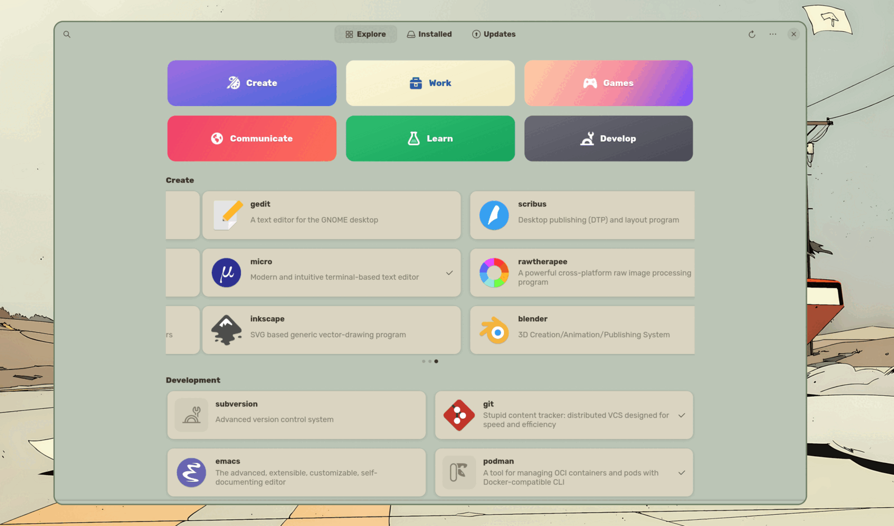

---

## Screenshots

<table>
  <tr>
    <td width="50%">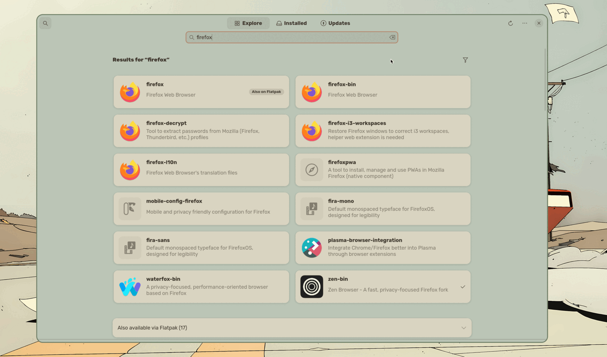</td>
    <td width="50%">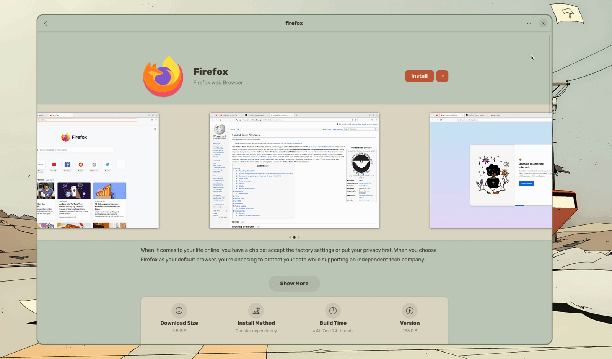</td>
  </tr>
  <tr>
    <td><b>Search</b><br><sub>Name and description matches, ranked, with Flatpak hits kept separate.</sub></td>
    <td><b>Package detail</b><br><sub>Upstream screenshots, plus download size, install method, build time, and version.</sub></td>
  </tr>
  <tr>
    <td width="50%">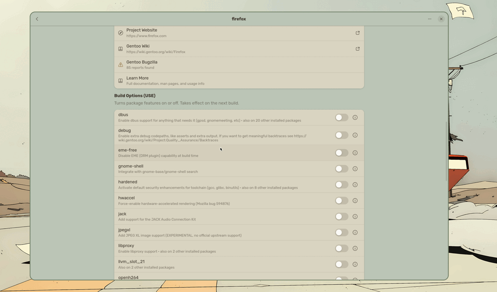</td>
    <td width="50%">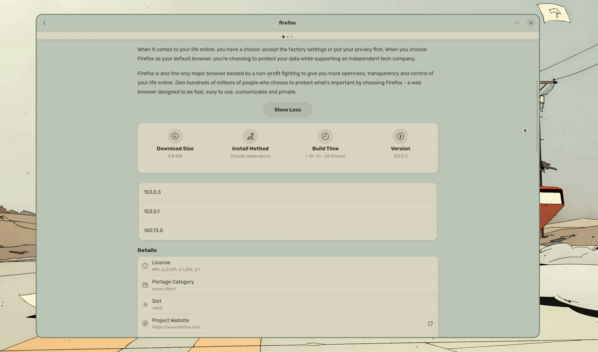</td>
  </tr>
  <tr>
    <td><b>Build options</b><br><sub>Every USE flag with its description, and how many other installed packages share it.</sub></td>
    <td><b>Versions and details</b><br><sub>What the tree offers, plus license, slot, and upstream links.</sub></td>
  </tr>
  <tr>
    <td width="50%">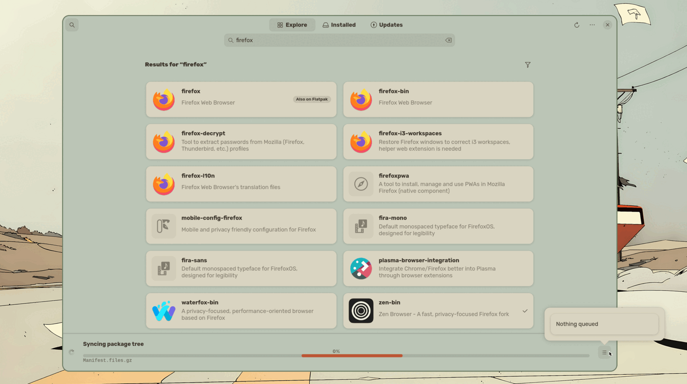</td>
    <td width="50%">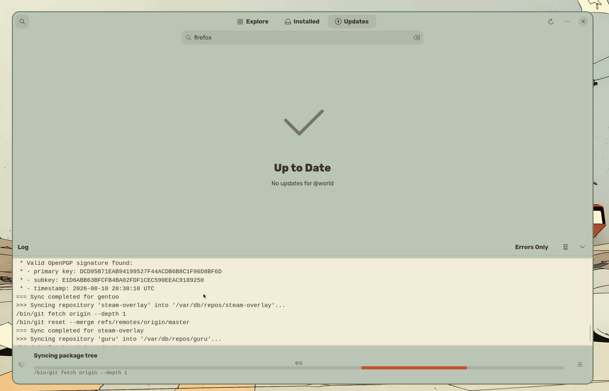</td>
  </tr>
  <tr>
    <td><b>Job queue</b><br><sub>What's running, and everything waiting behind it.</sub></td>
    <td><b>Live output</b><br><sub>The full build log, with an errors-only filter.</sub></td>
  </tr>
  <tr>
    <td width="50%">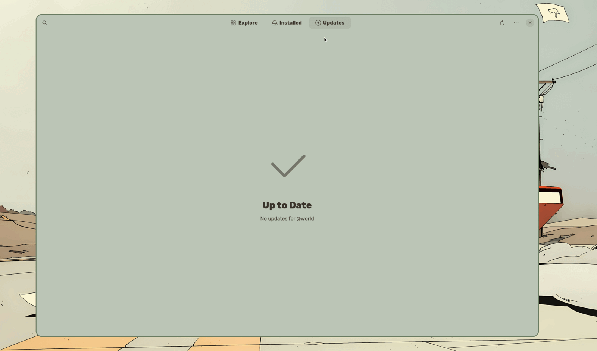</td>
    <td width="50%">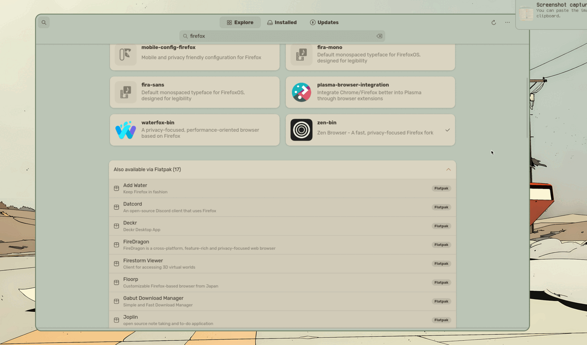</td>
  </tr>
  <tr>
    <td><b>Updates</b><br><sub>Pending <code>@world</code> updates, security advisories, and health banners.</sub></td>
    <td><b>Flatpak</b><br><sub>Flatpak-only matches, collapsed beneath the Portage results.</sub></td>
  </tr>
  <tr>
    <td width="50%">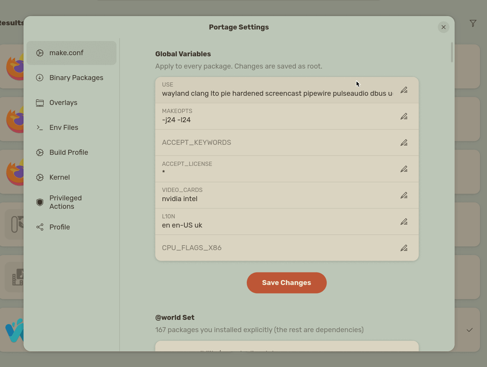</td>
    <td width="50%">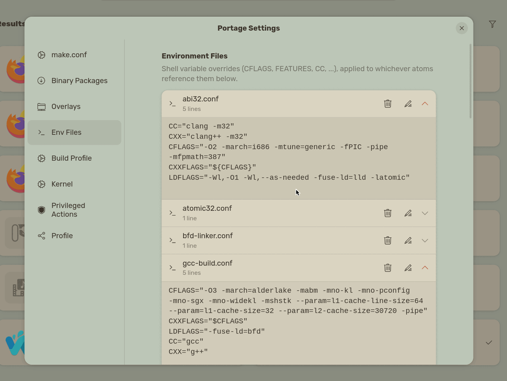</td>
  </tr>
  <tr>
    <td><b>Portage settings</b><br><sub><code>make.conf</code> as fields, with overlays, profile, and kernel alongside.</sub></td>
    <td><b>Env files</b><br><sub>Per-package <code>package.env</code> overrides, edited inline.</sub></td>
  </tr>
  <tr>
    <td width="50%">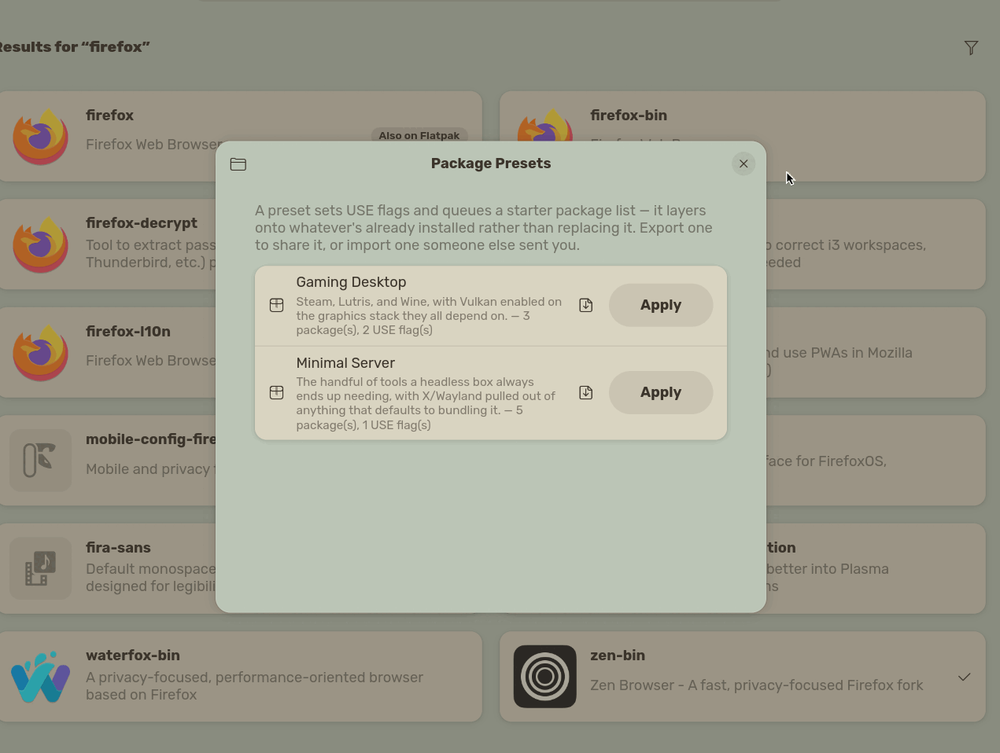</td>
    <td width="50%">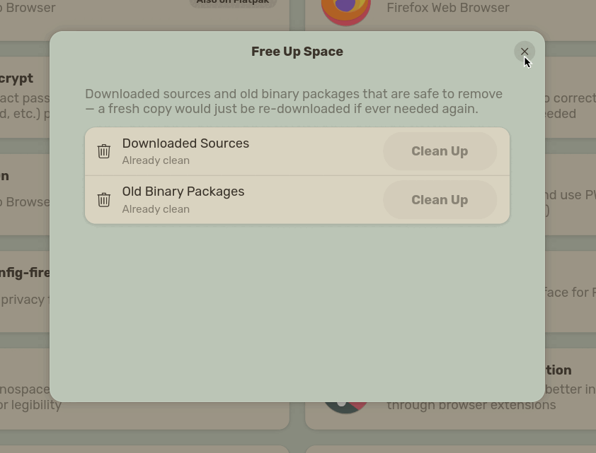</td>
  </tr>
  <tr>
    <td><b>Presets</b><br><sub>Shareable USE flags plus a starter package list.</sub></td>
    <td><b>Free up space</b><br><sub>What each Portage cache would reclaim, before clearing it.</sub></td>
  </tr>
</table>

---

## Features

### Finding things

- **Whole-tree in-memory index.** The first search parses one full `eix --xml` dump
  (~22k packages) and keeps it. Everything after that filters memory: ~600 ms once,
  ~2 ms per search thereafter. Dropped and rebuilt only when a sync completes.
- **Name *and* description search**, so "password" finds `keepass` and
  `bitwarden-desktop-bin`, not just packages with "password" in the name.
- **Typo tolerance.** When nothing matches well, a Levenshtein pass over the index
  suggests close names instead of returning an empty page.
- **Search operators** — `cat:games-*`, `use:wayland`, `installed:true`, `@world` —
  applied in memory, so changing one re-renders instantly.
- **Curated category tiles** and a landing page of themed carousels.

### Installing and managing

- **A single job queue.** Portage takes a global lock, so one `emerge` runs at a time
  and everything else waits its turn — reorderable and cancellable from a popover
  without touching what's already running.
- **Automatic conflict resolution.** A failed build that needs a USE flag, a keyword,
  a license acceptance, or a circular-dependency break is detected, explained, and
  offered as apply-and-retry.
- **Live build output**, with a log drawer, an errors-only filter, and a searchable
  history of past builds.
- **Build-time ETAs** from `qlop`'s own recorded merge history, counting down live.
- **Resource throttling** (on by default): builds run under `nice`/`ionice` with a
  RAM-aware `MAKEOPTS` cap instead of whatever's in `make.conf`. Added after an
  unthrottled build genuinely OOM-killed unrelated processes during development.
- **Night-only builds** (opt-in): queue things during the day, let them run at 23:00.
- **Sandbox builds.** When a package won't resolve on the live system, build it in a
  disposable chroot instead.
- **Downgrades** from locally cached binary packages.

### Knowing what's wrong

- **GLSA security advisories** via `glsa-check` — the one category no default Gentoo
  install surfaces anywhere unless you already know the tool exists. Shown in its own
  section above ordinary updates, with a one-click fix.
- **Unread Gentoo news** (GLEP 42), **pending `CONFIG_PROTECT` updates** with an
  inline diff reviewer and bulk accept, **sync staleness**, **preserved-rebuild**, and
  **orphaned packages**.
- **A health dashboard** combining all of it, with optional periodic background checks
  and trend history ("this has been pending 6 days").

### Understanding a package

- Dependency preview, download size, and compile-vs-prebuilt — cached by atom+version,
  disk-backed with a 1-hour TTL so it survives a restart.
- **Reverse dependencies** — "why is this installed?" walks up to an `@world` ancestor,
  bounded on depth, fan-out, *and* total subprocess calls so one click on `glib` can't
  spawn thousands.
- USE flag editor showing where each flag's current value actually comes from.
- Man page, upstream AppStream metadata, GitHub social card, and Gentoo wiki/Bugzilla
  mentions, when they exist.

### Sharing a setup

- **Presets** — a named bundle of USE flags plus a starter package list ("Gaming
  Desktop", "Minimal Server") that layers onto what's already installed. Export to
  JSON, import someone else's.
- **Profile bundles** — the whole picture: `@world` plus every file under
  `/etc/portage`, tarred up. Importing shows a diff of what would actually change
  before touching anything.

### System configuration

Overlays (enable GURU and friends), `make.conf` variables, `package.env` overrides,
kernel selection, profile switching, and binary-package repositories — each a focused
page over its own module.

Every write this app makes under `/etc/portage` is **committed to a git repo there**,
browsable and revertible from the GUI.

### Flatpak

A second, fully independent job lane. Flatpak has no global lock, so a Flatpak update
never waits behind an hours-long `@world` rebuild. Flatpak-only search hits appear as a
collapsed strip beneath the Portage results, never mixed into them.

---

## Requirements

**Build:** Rust 1.85+ (2024 edition; developed against 1.96), `gui-libs/gtk` 4.12+,
`gui-libs/libadwaita` 1.5+.

**Runtime:**

| Tool | Package | Used for |
| --- | --- | --- |
| `emerge`, `portageq`, `glsa-check` | `sys-apps/portage` | installs, updates, advisories |
| `eix` | `app-portage/eix` | the search index (run `eix-update` first) |
| `equery` | `app-portage/gentoolkit` | reverse dependencies |
| `qlop` | `app-portage/portage-utils` | build-time history / ETAs |
| `eclean-dist`, `eclean-pkg` | `app-portage/gentoolkit` | cache cleanup |
| `doas` | `app-admin/doas` | the privilege helper (see below) |
| `curl`, `git`, `tar`, `df`, `man` | base system | artwork, config history, bundles |
| `flatpak` | `sys-apps/flatpak` | *optional* — the Flatpak lane auto-disables without it |

---

## Installing

### Build

```sh
git clone https://github.com/tarilka0gg/portage-store.git
cd portage-store
cargo build --release
```

Produces `target/release/portage-store` (GUI) and `target/release/portage-store-cli`.

The in-app web preview is behind an off-by-default feature flag, because WebKitGTK is
one of the slowest packages on Gentoo to build and this app does not need it — links
open in your browser instead. Enable it with `--features webview` if you want it.

### Set up the privilege helper

**This is required** — without it, anything that writes to the system will fail.

```sh
# 1. Install the helper scripts, root-owned and not writable by your user
sudo mkdir -p /usr/local/libexec/portage-store
sudo install -m 0755 -o root -g root resources/priv-helper.sh \
    /usr/local/libexec/portage-store/priv-helper
sudo install -m 0755 -o root -g root resources/sandbox-build.sh \
    /usr/local/libexec/portage-store/sandbox-build.sh

# 2. Create its audit log
sudo mkdir -p /var/log/portage-store
sudo chown root:portage /var/log/portage-store
sudo chmod 0750 /var/log/portage-store
sudo touch /var/log/portage-store/priv-helper.log
sudo chown root:portage /var/log/portage-store/priv-helper.log
sudo chmod 0640 /var/log/portage-store/priv-helper.log

# 3. Allow it to run without a password, for your user only
echo "permit nopass $USER cmd /usr/local/libexec/portage-store/priv-helper" \
    | sudo tee -a /etc/doas.conf
```

Then install the binaries wherever you like (`~/.local/bin`, `/usr/local/bin`, …).

---

## The privilege model — read this

Everything privileged goes through **one root-owned script**, reachable by a
passwordless `doas` rule scoped to exactly that one path.

This is a real, deliberate tradeoff, so it's stated plainly:

- **There is no password prompt.** A passwordless rule means nothing stands between
  "the app asked for this" and "it happened as root."
- **In exchange, the attack surface is made as narrow as possible.** No privileged call
  ever carries script text. The helper is invoked with a *subcommand name* and
  arguments — never `bash -c "$SOMETHING"` — and the script itself lives root-owned on
  disk, referenced only by name.
- **The helper does not trust its caller.** Every path is re-validated on the root side:
  it must resolve (after canonicalization, closing symlink-swap races) under
  `/etc/portage` or `/etc` as appropriate, and the runnable-binary list is an allowlist,
  not a filter.
- **Every privileged call is logged**, by root, to `/var/log/portage-store/priv-helper.log`
  — the compensating control for having no prompt. The GUI has a page to read it.

Read `resources/priv-helper.sh` before installing. It is deliberately written to be read.

---

## The CLI

Same core, no window. Every subcommand is a thin wrapper over the same functions the
GUI calls — not a reimplementation.

```sh
portage-store-cli search firefox
portage-store-cli show www-client/firefox
portage-store-cli list-installed
portage-store-cli updates

portage-store-cli install app-misc/tmux --pretend
portage-store-cli install app-misc/tmux
portage-store-cli uninstall app-misc/tmux
portage-store-cli update-world --pretend
portage-store-cli sync

portage-store-cli preset list
portage-store-cli preset apply "Minimal Server"
portage-store-cli preset apply-file ./my-preset.json
```

Mutating commands stream `emerge` output live and exit non-zero on failure, so they
compose fine in scripts.

---

## Architecture

Three pieces, one direction of dependency:

```
  portage-store  (GTK4 GUI)      portage-store-cli  (clap)
              \                 /
               \               /
            portage_store  (lib)          ← no GTK, no UI state
                     |
     eix · emerge · qlop · glsa-check · flatpak
     doas+helper · /etc/portage · /var/db/pkg
```

- **`src/portage/`, `src/backend.rs`, `src/flatpak.rs`** — the domain layer. Everything
  that knows how Gentoo works: parsing `eix --xml`, building `emerge` argv, reading
  `@world`, writing `package.use`. Plain functions returning plain structs. Zero
  `gtk`/`adw` references anywhere in it, which is exactly what made the CLI cheap to
  add rather than a rewrite.
- **`src/ui/`** — all the GTK. Split by area (`queue.rs`, `checks.rs`, `browse.rs`,
  `flatpak_lane.rs`, `log_drawer.rs`, one file per dialog), each taking `&Rc<App>`.
- **`src/bin/portage-store-cli.rs`** — the terminal front end.

Where to look, by feature:

| Module | Owns |
| --- | --- |
| `eix.rs` | tree index, search, category browse, lookup |
| `emerge.rs` | job builders, streaming runner, pretend cache, output parsers |
| `priv_write.rs`, `command.rs` | the one privileged-write seam, and its test harness |
| `glsa.rs`, `news.rs`, `config_protect.rs`, `sync.rs` | the four health banners |
| `reverse_deps.rs` | "why is this installed", with its own recursion budget |
| `qlop.rs`, `resource_limits.rs` | build-time history and throttling math |
| `preset.rs`, `profile_bundle.rs` | the two "share my setup" shapes |
| `media.rs`, `icons.rs` | the two on-disk artwork caches |

---

## Development

```sh
cargo build
cargo test           # 255 tests, no live system required
cargo run
```

Tests never touch a real subprocess: parsers are fed captured fixtures, and the two
places that genuinely interleave subprocess calls with logic (`priv_write.rs`,
`reverse_deps.rs`) go through a `CommandRunner` trait with a fake implementation. So
`cargo test` passes on a non-Gentoo machine.

---

## Packaging

`packaging/` holds a work-in-progress ebuild, `metadata.xml`, `.desktop` entry,
AppStream metainfo, and a placeholder icon, aimed at eventual submission to
[GURU](https://wiki.gentoo.org/wiki/Project:GURU). **Not submitted, and not yet
correct** — `packaging/README.md` lists exactly what needs fixing first, including a
real helper-path mismatch between the ebuild and the compiled-in constant.

---

## License

[GPL-2.0](LICENSE), matching Portage and Gentoo's own licensing.
